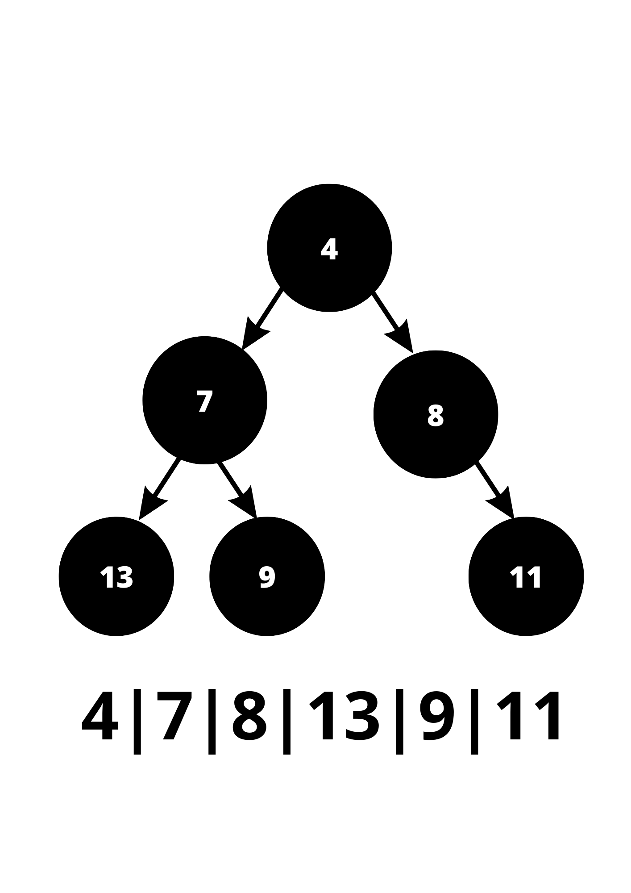

# Heap Para Pesquisa dos Top K Elementos

#### Algoritmos e Estrutura de Dados 2

#### Compatibilidade e Desenvolvimento

  

## Índice
 - [Introdução](#Introdução)

 - [Fundamentação Teórica](#Fundamentação-Teórica)
    - [Estruturas de Dados](#Estruturas-de-Dados)
    - [Algoritmos](#Algoritmos)
        - [Uma breve Introdução aos Operadores Bit a Bit](#uma-breve-introdução-aos-operadores-bit-a-bit)
        - [MurmurHashUnaligned2](#murmurhashunaligned2)
        - [MinHeapify](#minheapify)

 - [Objetivos](#objetivos)

 - [Metodologia](#metodologia)
    - [Arquivos](#arquivos)
        - [Entradas](#entradas)
    - [Funcionamento](#funcionamento)
        - [1. Primeira Leitura do Arquivo](#1-primeira-leitura-do-arquivo)

            - [1.1. Casos Especiais](#11-casos-especiais)
        
        - [2. Constuindo a Hash](#2-construindo-a-hash)

        - [3. Construindo o Heap](#3-construindo-o-heap)

            - [3.1. Heap Mínimo dos Maiores Valores](#31-heap-mínimo-dos-maiores-valores)
        
        - [4. Ordenando o Heap](#4-ordenando-o-heap)

 - [Conclusão, Reflexões e Aprendizados](#conclusc3a3o-reflexc3b5es-e-aprendizados-1)
    - [União de Estruturas de Dados e Algoritmos](#união-de-estruturas-de-dados-e-algoritmos)
    - [Leitura O(1)](#leitura-o1)
    - [K * n * log(K)](#k--n--logk)
    - [Aprendizados](#aprendizados)

- [Compilação e Execução](#Compilação-e-Execução)
- [Ambiente de Desenvolvimento](#Ambiente-de-Desenvolvimento)

- [Referências](#Referências)
  

## Introdução
Este repositório apresenta  a solução para um problema proposto na disciplina de Algoritmos e Estruturas de Dados 2. Para isso foi requisitado que palavras de um arquivo de entrada fossem armazenadas em uma Hash. Adiante as entradas seriam passadas para um Heap em função de obter 20 palavras mais frequentes da estrutura de Hash criada(as chaves são representadas por palavras e os seus valores são o número de vezes que a palavra aparece no arquivo). Para isso considere as seguintes colocações:

- Nomes de diretórios, ou arquivos serão referênciados da seguinte forma: `Nome.txt` ou `Diretório_2`.

- Nomes de variáveis: _`a`_, _`b`_.

- Nomes de funções: **`xpto()`**, **`sum()`**.

- $r$ - A raíz de um $He$

- $He$ - Um Heap qualquer.

- $N$ - Conjunto de nós de uma heap.

- $Ha$ - Uma Hash qualquer.

- $f(x)$ - A função que indexa elementos de uma $Ha$.

- $h_{i}$ - Um elemento qualquer pertencente à uma Hash $H$ no índice $i$.

- $K$ - Número de palavras pertencentes ao ranking das palavras mais citadas, ou , tamanho do $He$ utilizado na implementação.

- $n$ - Tamanho de $Ha$.

- $s$ - valor aleatório também chamado de semente que contribui para randomização em $f(x)$.

- $k$ - Chave qualquer em $Ha$;

- $P$ - Pair, ou estrutura de dados que instância 2 atributos, pode-se abstraí-los para uma chave e um valor por exemplo.

- Nomes de comandos digitados no terminal,funções ou variáveis serão referênciados da seguinte forma: _**touch main.cpp**_, _**make run**_.

## Fundamentação Teórica
- Para contextualizar o funcionamento do algoritmo, considere como entrada textos armazenados em arquivos sem nenhuma formatação(Arquivo ASCII) onde cada sentença termina por um sinal de pontuação (".", "?", "!"):
    - Uma palavra é uma sequência de letras delimitada por um espaço em branco, "coluna da esquerda", "coluna da direita" e símbolos de pontuação.
    - Stop words são palavras que desconsideradas na leitura do arquivo de entrada.
- Ao final da execução do programa é esperado que a saída mostre um o ranking de $K$ ordenado de forma crescente, de forma que parte do processo de ordenação seja realizado durante a inserção dos valores de entradas em uma estrutura $He$.

### Estruturas de Dados
- Para solucionar o problema a alocação dos valores de entrada foi realizada primordialmente em uma $Ha$. Sendo que ao fim da leitura dos arquivos de entrada, seria realizada a construção do $He$ consultando os valores de $Ha$ de $20$ em $20$ elementos.

### Algoritmos
- Os algoritmos utilizados para $f(x)$ indexar valores em $Ha$ e para que $He$ tenha sempre menores valores em $r$ são respectivamente:
    - A $f(x)$ utilizada é a <a href = "https://github.com/aappleby/smhasher/blob/master/src/MurmurHash2.cpp">MurmurHashUnaligned2</a> pelo fato da hash criada utilizar unordered_map como estrutura de dados auxiliar.
    - E **`MinHeapify()`** ¹ é utilizado para sempre manter o menor valor do heap em $r$ enquanto houver inserções. Neste caso o método foi criado pelo autor e pode ser melhor compreendido através da documentação elaborada no arquivo `StructuresAndSignatures.cpp`.
    
    #### Uma breve Introdução aos Operadores Bit a Bit
- Operadores bit a bit substituem operadores de soma, subtração, divisão, módulo e subtração e essenciais para entender como os computadores realizam hashing² e criptografia³. Tudo isso levou Huffman à criar um Algoritmo para compressão de dados⁴ ⁵ dada tamanha importância desse recurso.

Em função de entender melhor o algoritmo de MurmurHAshUnaligned2, observe à tabela abaixo:

<table>

<tr>
<td colspan = '1'><strong>Operações Bit à Bit</strong></td>
<td align = "center" colspan = '1'><strong>A em binário</strong></td>
<td align = "center" colspan = '1'><strong> B em binário </strong></td>
<td align = "center" colspan = '1'><strong> A em decimal</strong></td>
<td align = "center" colspan = '1'><strong> B em decimal</strong></td>
<td align = "center" colspan = '1'><strong> Resultado em binário</strong></td>
<td align = "center" colspan = '1'><strong> Resultado em decimal</strong></td>
</tr>

<tr>
<td align="center"><strong><i><<</i></strong>
</td>
<td align="center">1100</td>
<td align = "centrer">0001</td>
<td align = "centrer"> 12 </td>
<td align = "centrer"> 1 </td>
<td align = "centrer"> 11000 </td>
<td align = "centrer"> 24 </td>
</tr>

<tr>
<td align="center"><strong><i>>></i></strong></td>
<td align="center">1100</td>
<td align = "centrer">0001</td>
<td align = "centrer"> 12 </td>
<td align = "centrer"> 1 </td>
<td align = "centrer"> 0110 </td>
<td align = "centrer"> 6 </td>
</tr>

<tr>
<td align="center"><strong><i>^</i></strong></td>
<td align="center">1100</td>
<td align = "centrer">0001</td>
<td align = "centrer"> 12 </td>
<td align = "centrer"> 1 </td>
<td align = "centrer"> 1101 </td>
<td align = "centrer"> 13 </td>

</table>

**Observação**: Considere A e B operandos  dos operadores bit à bit em uma aplicação escrita em linguagem C e não uma analogia ao uso dos operadores de deslocamento de bit em assembly.

#### MurmurHashUnaligned2
Para ler o código basta acessar o link indexado no nome do algoritmo. O texto abaixo tem como função esclarecer o leitor apresentando-lhe trechos operações com bits e loops iterativos usando número de bytes de variáveis. Portanto segue seu funcionamento:

1. Obtem-se como parâmetros o tamanho de $Ha$ ou $n$, um valor denominado seed, ou seja, $s$ e o valor que será armazenado na hash, ou seja a chave $k$.
    - $n$ é um **`int`**.
    - seed ou $s$ é um **`uint32_t`** ou **`uint64_t`** ou **`uint16_t`** ou **`uint8_t`**, ou seja um inteiro sem sinal de tamanho igual à 8, 16, 32 ou 64 bits sendo provido apenas caso a aplicação suporte esse tipo.
    - A chave é um ponteiro para os dados que serão armazenados, sendo assim é um **`const void * `**.

2. Definem-se duas constantes para realização de operações utilizando os bits($M$ e $R$) dos dados à serem armazenados, ou seja, os bits da chave. 

3. Inicializam-se as opreações para ter um valor aleatório de indexação $h$, para isso a primeira operação que define $f(x)$ é $n{\oplus}s$.

4. Inicializa-se um ponteiro do mesmo tipo da chave apontando para o início da mesma, denominado `data`.

5. É realizado então um laço de repetição é criado utilizand $n$ como referência caminhando de quatro em quatro bytes (decrescendo $4$ de $n$) até que $n$ seja 0.

6. A cada iteração um typecast de ponteiros passa os próximos 4 bytes de dados da variável `data` para a variável $k$ e em seguida as operações abaixo acontecem :
    1. $k = k \times M$
    2. $k = k  \oplus (k \gg R)$
    3. $k = k \times M$
    4. $h = h \times M$
    5. $h = h \oplus k$

7. As iterações acabam quando todos os bytes em `data` forem percorridos, ou seja quando $n\leq 4$.

8. Um switch case usa $n$ como parâmetro após as sucessivas subtrações realizadas, e então opearções de deslocamentos de bit são feitos com o conteúdo de data à depender de qual valor $n$ assume. Esse resultado é chamado de $o$, então:
    1. $h =  o \oplus h$.
    2. $h =  h \times M$.
9. Por fim as seguintes operações são realizadas:
    1. $h = h \oplus (h \gg 13)$
    2. $h = h \times M$
    3. $h = h \oplus (h \gg 15)$

10. Só então o valor de $h$ é retornado como índice onde $k$ poderá ser armazenado.

#### MinHeapify
- O processo de MinHeapify é realizado de forma à tentar manter o menor elemento de $He$ em $r$, para isso o código a função **`pile_the_heap()`** foi implementada no arquivo `StructuresAndSignatures.cpp`. Essa função percorre o $He$ da metade do vetor até o primeiro elemento acessando nós filhos do valor presente no índice atual, quando um nó filho é menor que o valor contido no índice atual, **`swap()`** é chamada trocando a posição destes no $He$. Para compreensão clara do processo basta visualizar a animação abaixo:

 
<strong>Figura 1 -</strong> Min-Heapify
 

 
Fonte: Disponível no <a href = "https://devdojo.com/algonoob/min-heap-algorithm">link</a>.
 
____________________________________________

## Objetivos:
A problemática proposta pelo trabalho incita os alunos da disciplina a efetuar a implementação de uma $Ha$ que aliada à uma $He$ possam manter o custo de $O( n\times ln(k) )$, sendo neste caso n o tamanho da coleção de dados e k o número de itens mais relevantes seguindo as diretrizes da fundamentação teórica.

 

## Metodologia:
### Arquivos:
Para resolução do desafio os seguintes arquivos de entrada foram sujeridos: 
 - `DomCasmurro.data`: Um arquivo que contém a obra Dom Casmurro do escritor Machado de Assis.

 - `Semana_Machado_Assis.data`: Um arquivo que contém a obra A Semana do escritor Machado de Assis. 

 - `Stopwords.data`: Um arquivo que contém as palavras à serem desconsideradas na proposta. 

- `Makefile` : Controla a geração dos executáveis e a compilação dos mesmos(FREE SOFTWARE FOUNDATION, GNU make, 2023).

- `main.cpp` : Executa as funções implementadas para ambas às entradas.

- `StructuresAndSignatures.cpp` : Contém todas as funções globais e métodos de classe implementadas.

- `StructuresAndSignatures.hpp` : Contém as assinaturas das funções globais, métodos de classe, bem como as declarações de classe.

#### Entradas
 

<strong>Figura 2</strong> - DomCasmurro.data    
 
 

 
Fonte: Captura de tela feita pelo autor².
 
____________________________________________
 ²Captura de tela do computador do autor.

 
 
 

<strong>Figura 3</strong> - Semana_Machado_Assis.data    
 
 

 
Fonte: Captura de tela feita pelo autor³.
 
____________________________________________
 ³Captura de tela do computador do autor.

 
 
 

 
<strong>Figura 4</strong> - Stopwords.data    
 
 

 
Fonte: Captura de tela feita pelo autor⁴.
 
____________________________________________
 ⁴Captura de tela do computador do autor.

 

### Funcionamento

 #### 1. Primeira Leitura do Arquivo
 - As leituras dos arquivos de entrada são configuradas através dos elementos do vetor paths no arquivo `main.cpp`. Os elementos contidos nessa variável são os nomes dos arquivos de entrada.

 #### 1.1. Casos Especiais
 - Caso a leitura das entradas não seja possível de ser realizada a seguinte mensagem aparece na tela:

  

<strong>Figura 5</strong> - input.data    
 

 
Fonte: Captura de tela feita pelo autor⁵.
 
____________________________________________
 ⁵Captura de tela do computador do autor.

 

 #### 2. Construindo a Hash
 - Em seguida é criada uma hash utilizando a função **`fileReader()`**, recebendo como parâmetro o caminho até as entradas, e um vector de strings denominado **`words`**, a função usa o arquivo de entrada para criar a hash retornando um unordered_map e modificando a variável **`words`**. O unordered_map é armazenado na variável **`hashwords`** uma $Ha$ com chaves iguais à cada elemento em **`words`**, são estas strings com cada palavra no arquivo de entrada. Além disso tudo vale ressaltar que as chaves contidas em **`hashwords`** são palavras que não estão contidas no arquivo `Stopwrods.data`, para entender melhor como isso é feito, basta ler a documentação das funções **`isStopWord()`** e **`readStopWordsFile()`**. Caso queira entender como o processo de Hashing funciona em no unordered_map basta retornar à [Algoritmos](#murmurhashunaligned2)

  #### 3. Construindo o Heap
 - O construtor do heap é chamado, depois este é preenchido com os valores da hash através da função **`fill_the_heap()`**. O heap tem tamanho $K$ que no código pode ser configurado alternado o valor da constante de nome K contida no arquivo `StructuresAndSignatures.hpp`. Portanto o heap inicialmente tem os primeiros $K$ elementos contidos em $Ha$

  ##### 3.1 Heap Mínimo dos Maiores Valores
 - Para construção de um $He$ Mínimo de forma que o a palavra menos citada entre as mais citadas se encontre em $r$, o seguinte acontece:
    - 1. A função **`bigger_value_researcher`** é chamada.

    - 2. Dentro da função é chamada a função **`pile_the_Heap()`**, esta executa uma algoritmo de min-Heapify. Em outras palavras, a função percorre $He$ da sua metade até o primeiro elemento, enquanto isso acontece a função **`organize()`** é executada à cada iteração do laço.

    - 3. **`organize()`** verifica quem é menor entre o nó pai e os nós filhos em relação ao índice atual. O menor valor entre os nós é trocado de índice com o nó pai.
    
    - 4. Ao fim da execução de **`pile_the_Heap()`** o menor valor se encontra na raíz do $He$. Ao fim da primeira execução dessa função, um laço de iteração é criado para percorrer $Ha$.
    
    - 5. Percorrendo $Ha$ à partir do elemento no índice $K$ o algoritmo verifica se o elemento atual de ${h}_i$ é maior que $r$, caso seja, $r$ se torna igual à ${h}_i$.

    - 6. A função **`pile_the_Heap()`** é chamada ao fim de cada iteração.

    - 7. Ao final do laço de execução a função **`bigger_value_researcher()` é finalizada. Dito isso, $He$ terá as $K$ palavras mais citadas da entrada que foi passada para construção de $Ha$.

#### 4. Ordenando o Heap

- O método de ordenação escolhido para obter um saída dos elementos em $He$ de forma crescente foi o Insertion Sort, chamado pela função **`InsertionSort()`**, pelo fato de que este método é executado com custo computacional linear quando a entrada está parcialmente ordenada. No caso de $He$, há elementos parcialmente ordenados devido às sucessivas chamadas de **`pile_the_Heap()`**. Além para Cunha, Ítalo(2012, slide 8)⁷:
    - 1. É o método mais interessante para entradas com menos de 20 elementos($He$ tem 20 elementos).
    - 2. É estável(não realiza troca de índices entre elementos de mesmo valor).
    - 3. É facilmente implementado.

- Por dizer que o vetor está parcialmente ordenado considere dizer que há uma sequência de elementos maior que um par ordenado partindo do índice 0. Já em um vetor ordenado aleatoriamente, considere que no índice 0 pode haver um valor maior que um par ordenado em índices maiores. A diferenciação colocada é essencial pelos seguintes motivos. Para Drozdek(2016, p.426)⁹ o que acontece se os dados estão em ordem aleatória o esforço de ordenação pela máquina é de $O(K²)$, sendo este o custo igual ao do pior caso. Já para Costa, Y. M. G. o custo é sempre muito baixo em casos de vetores parcialmente ordenados⁸, sendo este um custo que se aproxima do melhor caso, ou seja, $O(K)$.

<strong>Figura 6</strong> - Heap Parcialmente Ordenado    
 

 
Fonte: Construção pelo autor⁶.
 
____________________________________________
 Criada usando o Canva⁶, Disponível no <a href="">link</a>.

 

<strong>Figura 7</strong> - Heap Aleatoriamente Ordenado    
 

 
Fonte: Construção pelo autor⁷.
 
____________________________________________
 Criada usando o Canva⁷, Disponível no <a href="">link</a>.

#### 5. Saída
- Depois de todo este processo, considerando estas [entradas](#entradas) o programa emite a seguinte saída:

<strong>Figura 8</strong> - Heap Aleatoriamente Ordenado    
 

 
Fonte: Captura de tela feita pelo autor⁸.
 
____________________________________________
 Captura de tela do computador do autor⁸. 

 
 

<strong>Figura 9</strong> - Heap Aleatoriamente Ordenado    
 

 
Fonte: Captura de tela feita pelo autor⁹. 
 
____________________________________________
 Captura de tela do computador do autor⁹.

 
 

<strong>Figura 10</strong> - Heap Aleatoriamente Ordenado    
 

 
Fonte: Captura de tela feita pelo autor¹⁰.
 
____________________________________________
 Captura de tela do computador do autor¹⁰.

 
 

<strong>Figura 11</strong> - Heap Aleatoriamente Ordenado    
 

 
Fonte: Captura de tela feita pelo autor¹¹.
 
____________________________________________
 Captura de tela do computador do autor¹¹.

 
 

## Conclusão, Reflexões e Aprendizados

### União de Estruturas de Dados e Algoritmos
- Conclui-se portanto que as estruturas de Hash e Heap em conjunto podem reduzir drásticamente o custo de implementação de uma programa que poderia usufruir apenas de listas para seu funcionamento. 

### Leitura O(1)
- Afinal durante a leitura do arquivo de entrada a Hash constantemente atualiza os valores de suas chaves, isso tem custo próximo à $O(i)$ pela implementação que usufrui da estrutura de dados unordered_map, de forma que se houvesse sido feito todo o processo com listas, o custo seria de caminhar até o índice onde a chave foi armazenada($O(i)$ considerando ${i}_h$ em uma $Ha$) em uma lista para acessar um $P$ por exemplo e assim atualizar os valores.

### K * n * log(K)
- Além de tudo à critério de atualizar os valores da raíz utilizando o algoritmo heapify ou no caso da implementação **`pile_the_Heap()`** foi percebido que usufruir da caminhamento em heap minimizou o custo de acesso e troca entre os elementos. Tendo aproximadamente $n \times log(K)$ como custo para obtenção de um Heap não ordenado com os $K$ elementos mais citados da entrada e $K \times n \times log(K)$ para obter esse Heap ordenado usufruindo do Insertion Sort como método de ordenação.

### Aprendizados
- A combinação de estruturas de dados minimiza o custo de forma impactante na solução de problemas com grande quantidade de dados. A escolha destas estruturas como estratégia para solucionar o que é proposto deve passar pelas seguintes perguntas:
    - 1. Há mais inserção, deleção ou leitura de dados?
    - 2. Qual estrutura de dados e algoritmos favorecem esse caso?
    - 3. Há como combinar estruturas e algoritmos para aperfeiçoar a solução pensada?

## Compilação e Execução
Para compilação e execução do código é necessário que seja criado um arquivo Makefile. Para uso deste arquivo da forma correta, siga as diretrizes de execução abaixo:

<table>

<tr>
<td colspan = '1'><strong>Comandos</strong></td>
<td align = "center" colspan = '1'><strong>Funções</strong></td>
</tr>

<tr>
<td align="center"><strong><i>make clean</i></strong>
</td>
<td align="center">Deleta o arquivo executável e todos os arquivos objetos do diretório. (FREE SOFTWARE FOUNDATION, GNU make, 2023)</td>
</tr>
<tr>
<td align="center"><strong><i>make</i></strong></td>
<td align="center">Compila diferentes partes do programa através do g++ e cria um arquivo executável na pasta build. </td>
</tr>
<tr>
<td align="center"><strong><i>make run</i></strong></td>
<td align="center">Executa o programa da pasta build após a realização da compilação. (PIRES, MICHEL, 2023)</td>
</tr>
</table>

## Ambiente de Desenvolvimento:
O código foi desenvolvido e testado no seguinte ambiente de desenvolvimento:

<table align="center">
<tr>
<td colspan = '1' align="center"><strong>Peças</strong></td>
<td align = "center" colspan = '1'><strong>Especificações</strong></td>
</tr>

<tr>
<td align="center"><strong><i>Processador</i></strong>
</td>
<td align="center">Intel(R) Core(TM) i5-3340M CPU @ 2.70GHz</td>
</tr>
<tr>
<td align="center"><strong><i>Memória RAM</i></strong></td>
<td align="center">8 GB </td>
</tr>
<tr>
<td align="center"><strong><i>Sistema Operacional</i></strong></td>
<td>Debian GNU/Linux 11 (bullseye)</td>
</tr>
</table>

  

## Referências

[1] smhasher/src/MurmurHash2.cpp at master · aappleby/smhasher. Disponível em: <https://github.com/aappleby/smhasher/blob/master/src/MurmurHash2.cpp>. Acesso em: 25 ago. 2023.‌

[2]Lab 13: Hashing & Bitwise Operations. [s.l: s.n.]. Disponível em: <https://mathcs.pugetsound.edu/~aasmith/cs261/lab13.pdf>. Acesso em: 25 ago. 2023.

[3] XOR bitwise operation (article) | Ciphers. Disponível em: <https://www.khanacademy.org/computing/computer-science/cryptography/ciphers/a/xor-bitwise-operation>. Acesso em: 25 ago. 2023.

[4] FEOFILOFF, P. Estruturas de Dados: Algoritmo de Huffman. Disponível em: <https://www.ime.usp.br/~pf/estruturas-de-dados/aulas/huffman.html>. Acesso em: 8 2023.

[5] PIRES, MICHEL. Aula de Algoritmos e Estruturas de Dados 2. , ago. 15AG.

[6]LEESON, J.; CICEKLI, N. Bitwise Op, Hash Tables. Disponível em: <http://www.cs.ucf.edu/courses/cop3502/sum2020/material/20-07-15/WrittenNotes-20-07-15.pdf>. Acesso em: ago. 25DC.

[7] CUNHA, ÍTALO. Comparação Entre os Métodos de Ordenação. Disponível em: <https://homepages.dcc.ufmg.br/~cunha/teaching/20121/aeds2/sortingcmp.pdf>. Acesso em: ago. 27DC.

[8] Costa, Y. M. G. Métodos de Ordenação. Disponível em: <http://www.din.uem.br/~yandre/AEDEP/ordenacao-grande.pdf>. Acesso em: ago. 27DC.

[9] DROZDEK, A. Estrutura de Dados e Algoritmos em C++. Tradução: Roberto Enrique Romero Torrejon. 4a. ed. São Paulo, SP: Cengage Learning, 2017. p. 426, 427

[10] CORMEN, T. H. et al. Introduction to Algorithms, third edition. [s.l.] MIT Press, 2009. Acessador em 27 de Agosto de 2023.

[11] GNU make. Disponível em: <https://www.gnu.org/software/make/manual/make.html>. Acessado em 27 de Agosto de 2023.

[12] GNU Make. Disponível em: <https://www.gnu.org/software/make/>. Acesso em: ago. 27.

## Contato
 

 
 

 
 

✉️ <i>joaogu.2001@gmail.com</i>

</a>

